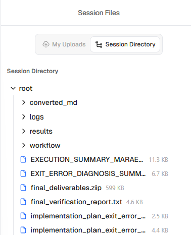

# K-Dense
The K-Dense social media team [hustles](https://x.com/k_dense_ai/with_replies) [hard](https://x.com/TimothyKassis/with_replies) anytime there is an AI scientist mention on Twitter.
I respect it.
It was enough to convince me to sign up and try their system for the competition.
My initial prompt was very similar to my initial Kosmos prompt with slight modifications because there is not a separate text box to describe the dataset and I was not sure what resources the virtual environment has.

The interface is not entirely intuitive.
After my initial prompt, the PDFs were converted to markdown files.
Then it seemed like nothing else was happening, so I made another prompt to "generate an excellent ML model as described above".
This restarted the "Generation in progress" status, and more files started to appear in my session directory.

It's not clear why generation stalled the first time.
*Update: Their Head of AI told me later that the system had been hitting some limits when processing large amounts of text files but the issue would be resolved soon.*

Once it resumed, I liked how the files were organized in a session directory that could be downloaded all at once at the end.

All output from this initial prompt is in the directory [`output1`](output1).
I again liked the organization of the output and found it fairly intuitive.
I extracted `final_deliverables.zip` within that directory.
It included a file `output1/final_deliverables/results/test_predictions.csv`, which was convenient and could be submitted directly to the competition.
