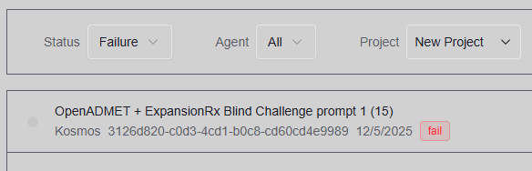
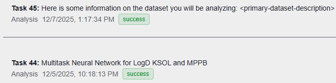

# Kosmos
With my Kosmos credits expiring, it was time to start on the OpenADMET + ExpansionRx Blind Challenge.

There was no time to iterate because a single Kosmos run may take many hours.
Therefore, I decided to learn from the best and build on [Andrew White's existing Kosmos run](https://dev.platform.edisonscientific.com/kosmos/8208890b-d46b-402d-b17f-6d69063f9cb1) that he [tweeted](https://x.com/andrewwhite01/status/1989822482011050123).
His original prompt is provided as `andrew-white-prompt.txt`.
I modified it into my prompt.
The main strategy was to provide additional resources, including Andrew's own Kosmos report, as input datasets.

The first run failed 80% of the way through after running for about 7 hours.
I'm not sure what happened, the last task was in the "success" state but no more tasks were initialized.

Eventually it resumed execution over a day later, to my surprise.

I added these outputs in the directory [`output1`](output1), and the artifacts are available at [Edison Scientific](https://platform.edisonscientific.com/kosmos/3126d820-c0d3-4cd1-b0c8-cd60cd4e9989).
`final_ensemble_transfer_predictions.csv` is from task 38.

I had already resubmitted another run with the same dataset and prompt, which succeeded.
The primary results are in the directory [`output2`](output2) because there is no easy way to download all of the artifacts.
The full set of artifacts are available at [Edison Scientific](https://platform.edisonscientific.com/kosmos/368185cd-80ca-4689-9b0d-1f5a1868c20c).
In general, I have found that Kosmos emphasizes the final human-readable report but makes it difficult to find final output files.
It was unclear what csv file to use for the competition predictions.
In the list of artifacts, the last csv file created was `submission_hybrid_7task_optimized.csv` from task 53, so I downloaded that file and used it for the submission.
However, it wasn't referenced in the final report.

The output from Kosmos `prompt3.txt` is pretty fun.
This prompt used a different strategy, providing the results from the initial K-Dense, Biomni, and Kosmos runs from this very repository as an input dataset.
[Task 3](https://platform.edisonscientific.com/kosmos/cfb15844-0095-4bd6-bf8f-e3d5bb1b8ba2/trajectories/2eaef4ed-41ab-438b-8089-9d12b1fad597) shows the analysis of the other AI scientists' models and reports.
It isn't clear from the report that this analysis actually influenced the rest of the computation though.
The overall structure of a Kosmos analysis is rigid: four discoveries with a text-based report as the main deliverable.
That can be restrictive for a prompt like this where the goal is to find the best single modeling strategy and produce the best possible predictions for an input set of compounds.
The report refers to a "final" model or set of predictions multiple times giving `FINAL FINAL FINAL DRAFT - v20 (1).docx` vibes.
Based on the report, I selected tasks 47's `predictions_final.csv` for the submission.
The full output and report are in [`output3`](output3) along with the full set of artifacts are available at [Edison Scientific](https://platform.edisonscientific.com/kosmos/cfb15844-0095-4bd6-bf8f-e3d5bb1b8ba2).

`prompt4.txt` was the same as the second KDense prompt, modified to use the Kosmos compute resources and split the dataset description into a separate file.
The Kosmos interface had changed subtly for this run.
For instance, I could no longer name the query when launching it in the same way as before.
I do not know if anything in the back end changed.
The primary results are in the directory [`output4`](output4).
Once again, each section of the report contains independent analyses so it is difficult to know which files to search for for the competition submission.
The stacked ensemble results (discovery 2) looked especially relevant, but that task did not have a csv file with predictions as a file to download, only png images.
I had to navigate the full output Artifacts searching for available csv files until I found `final_predictions_stacked.csv`, which may not have been the most relevant or correct file.
The full set of artifacts are available at [Edison Scientific](https://platform.edisonscientific.com/kosmos/93b71758-d473-41e4-9a9c-85a51def7ae6).
