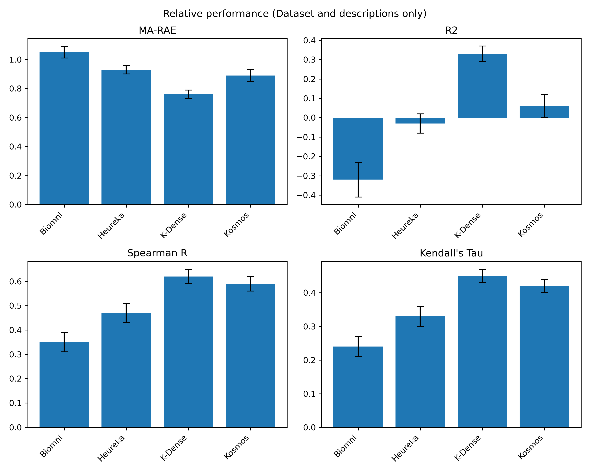
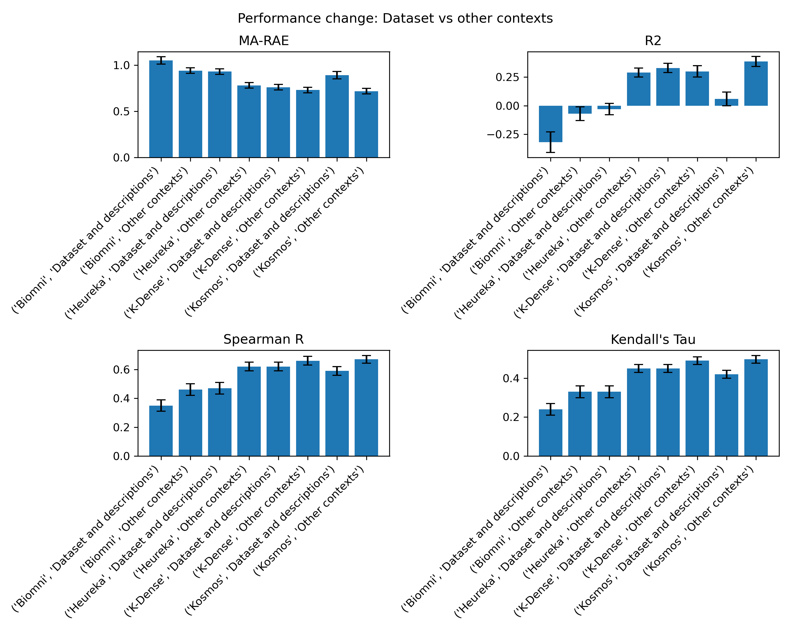
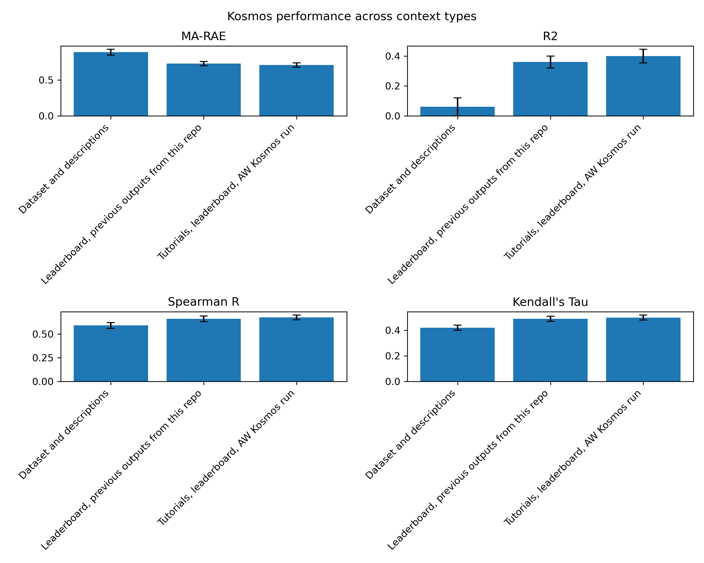

# Assessing AI Scientists on the OpenADMET + ExpansionRx Blind Challenge
Anthony Gitter  

## Introduction
A theme of 2025 was the prominence of AI (co-)scientists.
Scientific agents like [Coscientist](https://doi.org/10.1038/s41586-023-06792-0) and [ChemCrow](https://doi.org/10.1038/s42256-024-00832-8) had been available for a couple of years, but newer AI scientists sought generality by supporting more external tools and executing custom-written code, among other things.
A major challenge in my opinion is evaluating AI scientists to assess whether and how the field is making progress.
Retrospective evaluations of predictions on existing datasets are not that convincing.
Many of these tools used closed large language models (LLMs) or access the internet during execution, so it can be difficult to judge when a model is making new predictions versus reproducing information it has seen before.
Running the tools on problems where you have personal expertise gives anecdotal feedback about their strengths and weaknesses but is not a formal evaluation.
Some prospective evaluations have been well-designed, like [Biomni](https://doi.org/10.1101/2025.05.30.656746)'s wet-lab cloning protocol that had a scientist follow the generated protocol and used a base LLM and two experts of varying skill levels as controls.

Community challenges provide an excellent opportunity to assess computational methods, including AI scientists.
They offer unpublished, held out test data as well as a collection of strong competing methods from experts in the domain.
I chose the [OpenADMET + ExpansionRx Blind Challenge](https://huggingface.co/spaces/openadmet/OpenADMET-ExpansionRx-Challenge) [announced](https://huggingface.co/blog/hugging-science/the-expansionrx-openadmet-blind-challenge) in October 2025 to assess recent AI scientists.
"ADMET" refers to Absorption, Distribution, Metabolism, Excretion, and Toxicology chemical properties that are important in drug development.
I had [previously participated](https://github.com/agitter/asap-polaris-admet-challenge/blob/main/writeup.md) in the [ASAP Discovery x OpenADMET Challenge](https://doi.org/10.26434/chemrxiv-2025-zd9mr-v6) in early 2025 to evaluate whether [TabPFN](https://doi.org/10.1038/s41586-024-08328-6) would work out of the box for this problem (nope).
The new OpenADMET challenge had many attractive properties: the chemical property prediction task was in scope for most AI scientists, it was run by an experienced team, had test data for nine ADMET endpoints, and allowed multiple submissions throughout the challenge.

I initially intended to run a single AI scientist once on the challenge data but eventually expanded this project to running four tools under different settings.

## Methods
I selected four AI scientists:
- [Biomni](https://biomni.stanford.edu/) ([manuscript](https://doi.org/10.1101/2025.05.30.656746))
- [Heureka](https://www.heurekalabs.co/app/) AI Research Companion (ARC)
- [K-Dense](https://k-dense.ai/) ([manuscript](https://arxiv.org/abs/2508.07043))
- [Kosmos](https://platform.edisonscientific.com/) ([manuscript](https://arxiv.org/abs/2511.02824))

These were picked from a non-exhaustive [list of candidates](https://github.com/agitter/openadmet-expansionrx-challenge/tree/main?tab=readme-ov-file#other-ai-co-scientists-to-try) I compiled based on those I already knew about and a [tweet](https://x.com/rkosai/status/1973850436848525409) from the Potato CTO.
I only considered tools with a web interface that I could sign up for without talking to a sales team and that would provide free trial credits.
I looked into [Potato](https://www.potato.ai/), but it was not yet available.
I also ran [Gemini 3 Pro](https://gemini.google.com/).
Gemini failed to produce predictions, so I excluded it from the results below.

Before I started, I found that Andrew White, Co-Founder and CTO at Edison Scientific that created Kosmos, had already run Kosmos on the  OpenADMET + ExpansionRx Blind Challenge dataset.
Graciously, he [tweeted](https://x.com/andrewwhite01/status/1989822482011050123) his results and [linked](https://dev.platform.edisonscientific.com/kosmos/8208890b-d46b-402d-b17f-6d69063f9cb1) to his Kosmos output.
Rather than be discouraged by being scooped, I decided to directly build on his results.
Who knows better how to run an AI scientist than Andrew?

All four tools support uploading files and datasets along with a text prompt.
For my first batch of files, I included the Kosmos report from Andrew's linked run above that describes machine learning modeling strategies and results.
I also used his prompt as a base with only minor modifications.
In addition, I included other files as context: challenge announcements and descriptions as PDFs, the train and test datasets, exploratory Python scripts from the [organizers](https://github.com/OpenADMET/ExpansionRx-Challenge-Tutorial/blob/cf2dd9d7e6a82a5b6b62d83a14e7538d3d1eae4e/expansion_tutorial.ipynb) and [Pat Walters](https://github.com/PatWalters/practical_cheminformatics_posts/blob/80faa300e80c779edbe08294ab8f2058224c3b55/expansion_data_exploration/openadmet_expansion_exploration.py), a snapshot of the challenge leaderboard, the preprint from the previous OpenADMET challenge, and a team photo.
The details of these files and the full prompts provided to the AI scientists are cataloged in my [GitHub repository](https://github.com/agitter/openadmet-expansionrx-challenge).
This context is summarized as "Tutorials, leaderboard, AW Kosmos run" in the results below.

After completing the initial K-Dense, Biomni, and Kosmos runs with that style of prompt, I changed strategies.
I created a zip archive of the entire repository's contents, which included the reports and predictions from those three runs.
Then, I provided that file to Kosmos along with the train data, test data, and leaderboard snapshot.
This context is summarized as "Leaderboard, previous outputs from this repo" in the results table.

Finally, I observed that Andrew's Kosmos run was influencing the modeling choices of some of the other AI scientists.
To determine if they would use different machine learning strategies without that context, I created another set of prompts that provided only the challenge announcements and descriptions along with the train and test datasets.
This context is referred to as "Dataset and descriptions
" in the results.

Heureka has length restrictions on the input prompt, so in some cases I was unable to provide and describe all of the files I provided the other models.
The context in the results table is modified accordingly.

After creating a prompt, my workflow was to run the AI scientist, wait for it to terminate, download relevant outputs, identify the output file with the predictions on the test dataset, upload it manually to the HuggingFace [submission site](https://huggingface.co/spaces/openadmet/OpenADMET-ExpansionRx-Challenge), wait for it to be scored, and copy the scores for that submission into my GitHub repository.
This iterative process was tedious because some of the AI scientists (i.e. Kosmos) ran for a long time, and the submissions were not scored immediately after upload.
The submission site also limited how frequently submissions could be uploaded.
Kosmos made it difficult to find and download the most relevant output file, so I did my best to guess.

After making 10 submissions, I picked the previous submission that scored best and resubmitted it as my final entry.
Then, I used ChatGPT to generate a simple Python script to create bar graphs visualizing the metrics from my submissions.

## Results
The full results of my 11 submissions are below.
The ranks are not comparable because the number of other strong submissions on the leaderboard changed over time.
The context column is a summary of the context provided in the prompt and dataset (Methods).
Two submissions are duplicates or near duplicates.
Submissions 3 and 4 used the same prompt.
Submission 11 is a resubmission of submission 3 to create my final challenge entry.
Overall, Kosmos with context about previous tutorials and runs was my best performing model.

| Submission | Model | Prompt | rank | MA-RAE | R2 | Spearman R | Kendall's Tau | submission time | context |
| --- | --- | --- | --- | --- | --- | --- | --- | --- | --- |
| 1 | K-Dense | prompt1 | 80 | 0.73 +/- 0.03 | 0.30 +/- 0.05 | 0.66 +/- 0.03 | 0.49 +/- 0.02 | 2025-12-06 17:42:24+00:00 | Tutorials, leaderboard, AW Kosmos run |
| 2 | Biomni | prompt1 | 136 | 0.94 +/- 0.03 | -0.07 +/- 0.06 | 0.46 +/- 0.04 | 0.33 +/- 0.03 | 2025-12-07 03:18:52+00:00 | Tutorials, leaderboard, AW Kosmos run |
| 3 | Kosmos | prompt2 | 42 | 0.68 +/- 0.03 | 0.46 +/- 0.04 | 0.70 +/- 0.02 | 0.53 +/- 0.02 | 2025-12-08 03:39:59+00:00 | Tutorials, leaderboard, AW Kosmos run |
| 4 | Kosmos | prompt1 | 82 | 0.74 +/- 0.03 | 0.34 +/- 0.05 | 0.65 +/- 0.03 | 0.47 +/- 0.02 | 2025-12-08 18:11:15+00:00 | Tutorials, leaderboard, AW Kosmos run |
| 5 | Kosmos | prompt3 | 70 | 0.73 +/- 0.03 | 0.36 +/- 0.04 | 0.66 +/- 0.03 | 0.49 +/- 0.02 | 2025-12-09 03:40:34+00:00 | Leaderboard, previous outputs from this repo |
| 6 | Heureka | prompt1 | 156 | 0.78 +/- 0.03 | 0.29 +/- 0.04 | 0.62 +/- 0.03 | 0.45 +/- 0.02 | 2025-12-20 15:45:44+00:00 | Leaderboard |
| 7 | Heureka | prompt2 | 196 | 0.93 +/- 0.03 | -0.03 +/- 0.05 | 0.47 +/- 0.04 | 0.33 +/- 0.03 | 2025-12-21 23:53:27+00:00 | Dataset and descriptions |
| 8 | K-Dense | prompt2 | 147 | 0.76 +/- 0.03 | 0.33 +/- 0.04 | 0.62 +/- 0.03 | 0.45 +/- 0.02 | 2025-12-22 14:02:12+00:00 | Dataset and descriptions |
| 9 | Biomni | prompt2 | 211 | 1.05 +/- 0.04 | -0.32 +/- 0.09 | 0.35 +/- 0.04 | 0.24 +/- 0.03 | 2025-12-24 18:32:58+00:00 | Dataset and descriptions |
| 10 | Kosmos | prompt4 | 198 | 0.89 +/- 0.04 | 0.06 +/- 0.06 | 0.59 +/- 0.03 | 0.42 +/- 0.02 | 2025-12-27 14:04:23+00:00 | Dataset and descriptions |
| 11 | Kosmos | prompt2 | 91 | 0.68 +/- 0.03 | 0.46 +/- 0.04 | 0.70 +/- 0.02 | 0.53 +/- 0.02 | 2026-01-06 15:24:22+00:00 | Tutorials, leaderboard, AW Kosmos run |

The figure below examines how the different models perform when they are given minimal context, only the ADMET datasets and descriptions about the competition.
That is, they are not provided with any previous exploratory analyses or reports that guide them towards particular predictive modeling strategies.
In this setting, K-Dense has an advantage, narrowly per some metrics and more substantially per R2.

Looking across all models and contexts, we can examine how adding additional context helps the AI scientists.
In all cases it provides a benefit, often a considerable benefit.
I did not perform detailed ablations, so I cannot tell what specifically was most valuable for the predictive modeling.
Even with the additional context, Biomni lags behind the other three models.

I ran Kosmos in a unique setting where I gave it a zip of the current repository as context, which included results from the initial K-Dense, Biomni, and Kosmos runs.
That context was roughly equivalent to the other informative context I provided previously.

## User experience
After running four different AI scientists, I've accumulated some subjective thoughts about each.

Say (at least) one nice thing about:
- **Biomni**: It is fairly open and transparent, which I value. The planning and analysis is mostly linear, even when backtracking and updating plans, which makes it possible to attempt to scroll through all the generated code and output to understand what analysis was done. Free credits refresh on a weekly basis. Those features make me likely to return to it for simple, real work in the future.
- **Heureka**: I like interface of creating a project, writing a prompt, and then having a batch job run in the background once there was heavy work to complete. The output files were well-organized.
- **K-Dense**: The performance without context guiding the modeling strategy is worth mentioning. The [scientific skills](https://github.com/K-Dense-AI/claude-scientific-skills) are available outside the web app. The output files were well-organized. I especially liked the hierarchical layout and ability to easily download everything in batch. For these reasons, I returned to K-Dense for a real exploratory analysis related to protein clustering after the competition and was satisfied was that result.
- **Kosmos**: It blasts analyses at your problem. The magnitude of computation dwarfs the other tools I tried. This can lead to secondary or tertiary explorations that are not considered by the other tools.

Constructive feedback for:
- **Biomni**: Users cannot copy and paste long input prompts. Long inputs are treated as attachments, so the user has to break up the input into chunks of a few sentences and paste them in bit-by-bit. Users also cannot download the logs and file outputs without refreshing the page and reloading the past session. Results for similar prompts are cached so it isn't possible to directly evaluate outputs from different backend LLMs on the same input.
- **Heureka**: The [terms](https://heurekalabsco.github.io/terms/terms.html) concern me with respect to the language about granting the Company a license to publicly display User Content. The input prompt length limit is too short. Attempting to zip and download dozens of files in a single batch failed.
- **K-Dense**: The interface hangs when submitting a prompt with many attached files.
- **Kosmos**: The overall structure of a Kosmos analysis is rigid: four discoveries with a text-based report as the main deliverable. That can be restrictive for a project like this where the goal is to find the best single modeling strategy and produce the best possible predictions for an input set of compounds. It is difficult to find and download the best output `.csv` file across the multiple analyses in the report. The report references analysis tasks, but those tasks may not produce an output `.csv` file. I cannot find a way to download all the data artifacts and code generated. There are so many parallel analyses attempted, some of which are dead ends, that it feels hopeless to trace through them to understand in full what modeling was done.

## Discussion
So what have we learned from this exercise?
One of the most valuable takeaways for me personally was understanding the state of the art in AI scientists.
Reading about these tools doesn't give the same impressions as trying them yourself for some specific task, which I why I emphasized the user experience in a separate section independent of success on the scientific task.
My [Kosmos run](https://github.com/gitter-lab/adaptyvbio-nipah/tree/main/kosmos) for the [Adaptyv Nipah Binder Competition](https://proteinbase.com/competitions/adaptyv-nipah-competition) was done in a similar spirit.

My assessment of these AI scientists through the competition was quite limited relative to a formal computational method evaluation.
I did not check for sensitivity to how the prompt was specified, run with different backend LLMs when that could be selected, assess variability in outputs given the same prompt (with one exception), ablate different aspects of the provided prompt or data, and so forth.
The results are representative of what a typical scientist should expect from a single typical run with each tool.
The input may skew more towards the advanced end because it is derived from an expert's prompt who develops these methods.
Another limitation is that for convenience, I only ran AI scientists that could be accessed through a web interface.
Some of these same tools and other tools can be run in other settings where I could have given them access to more powerful computing resources, such as more memory and GPUs.
This could have substantially affected the models they trained and their ability to match top performers on the competition.
For these reasons, I am not drawing conclusions about one AI scientist being better than another.

Based on the results on the [leaderboard](https://huggingface.co/spaces/openadmet/OpenADMET-ExpansionRx-Challenge) and the descriptions of the experts' methodologies, experts have an edge over me using these AI scientists.
I'll wait to learn about what baseline methods the competition organizers tested and how those ranked relative to my submission before drawing other conclusions about the quality of the final Kosmos predictive model.

In closing, I'm reminded of the [AI effect](https://en.wikipedia.org/wiki/AI_effect), which describes shifting expectations around AI.
Marvin Minsky has [written](https://web.archive.org/web/20090628081048/http://www.kurzweilai.net/articles/art0100.html?printable=1) about it, but a more apt quote comes from Rodney Brooks in this 2002 [Wired article](https://www.wired.com/2002/03/everywhere/)
> Every time we figure out a piece of it, it stops being magical; we say, 'Oh, that's just a computation,'

A year ago, the types of AI scientists I tested in this competition didn't exist.
When I first ran Biomni, I was quite impressed by its combination of planning, code generation, dynamic tool installation, backtracking upon failure, and overall design even if it didn't necessarily produce the end result I had in mind.
Now the bar has shifted, and I'm asking if these tools can outcompete the best experts in the world.
Being impressed by these tools does not preclude objectively evaluating them.
